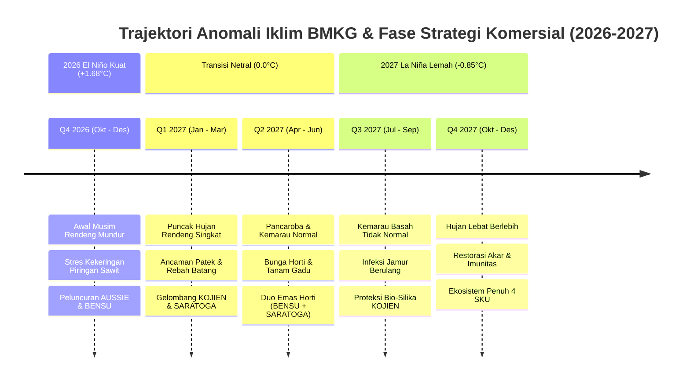

# Spesifikasi Riset Sinkronisasi Anomali Iklim BMKG & Kampanye Komersial 15 Bulan (Oktober 2026 – Desember 2027) — Agrimarket

**Dokumen Kontrak:** `docs/spec/CLIMATE-COMMERCIAL-CAMPAIGN-RESEARCH-2026-2027.md`  
**Staging Ref:** `~/Documents/work/prd/agrimarket/CLIMATE-COMMERCIAL-CAMPAIGN-RESEARCH-2026-2027.md`  
**Versi:** 2.0.0 — 2026-09-24  
**Otoritas:** Tim Klimatologi Pertanian, Komersial & Digital Performance Marketing Agrimarket  
**Cakupan Data:** BMKG 699 Zona Musim (ZOM), SI Katam Terpadu, ENSO Nino 3.4 (+1.68°C $\rightarrow$ -0.85°C), 15-Month Commercial Roadmap, Meta Ads Playbook

---

## 1. Analisis Fenomena Iklim BMKG & Dinamika ENSO/IOD Indonesia (2026–2027)

Berdasarkan analisis resmi Badan Meteorologi, Klimatologi, dan Geofisika (BMKG) serta pemodelan multi-model ensemble iklim global (ECMWF, NCEP, BoM):

### 1.1. Kondisi Tahun 2026: Fase Puncak El Niño Kuat (+1.68°C)
- **Indeks Anomali Suhu Muka Laut (SST) Nino 3.4:** Berada pada level $+1.68^\circ\text{C}$ (Kategori El Niño Kuat / *Strong El Niño*), disertai nilai Indian Ocean Dipole (IOD) positif $+0.76^\circ\text{C}$.
- **Dampak Agroklimat Nasional:**
  - Penurunan curah hujan sebesar 35–60% di bawah normal klimatologis pada 61.08% Zona Musim (ZOM) nasional.
  - Awal musim kemarau 2026 maju 2–4 dasarian di sentra pangan Jawa, Bali, NTB, dan Sulawesi Selatan.
  - Musim hujan rendeng 2026/2027 mengalami kemunduran (*delayed onset*) hingga pertengahan November di sebagian besar wilayah Jawa dan Sumatera bagian selatan.
  - Tekanan kekeringan (*water stress*) ekstrem memicu rontok pentil buah pada tanaman hortikultura dan aborsi tandan pada kelapa sawit.

### 1.2. Kondisi Tahun 2027: Fase Peluruhan Menuju La Niña Lemah (-0.85°C)
- **Transisi Iklim 2027:**
  - Peluruhan El Niño dimulai pada Kuartal I 2027, mencapai kondisi ENSO Netral (probabilitas 72%) pada April–Mei 2027.
  - Memasuki semester kedua 2027, anomali SST bergeser ke fase negatif $-0.85^\circ\text{C}$ (probabilitas 58% berkembang menjadi *Weak La Niña* / Kemarau Basah).
- **Dampak Agroklimat Nasional:**
  - Peningkatan curah hujan sebesar 20–40% di atas normal klimatologis pada musim kemarau (*wet dry-season*).
  - Kelembaban udara nisbi (RH) tinggi (> 80%) secara konstan sepanjang tahun.
  - Ledakan serangan penyakit jamur daun (*Phytophthora*, *Colletotrichum*, *Pyricularia*) dan bakteri hawar daun (*Xanthomonas*).

---

## 2. Roadmap Kampanye Komersial 15 Bulan (Oktober 2026 – Desember 2027)

| Bulan & Tahun | Status ENSO & Cuaca | Fase Tanaman & Komoditas | Ancaman Kritis Lapangan | Produk Hero & Mitra | Golden Window Komersial | Angle Iklan & Headline Meta Ads |
| :--- | :--- | :--- | :--- | :--- | :--- | :--- |
| **Bulan #1: Oktober 2026** | El Niño Kuat (+1.68°C); Awal Rendeng Terlambat | Pengolahan Lahan MT 1; Semai Cabai, Bawang & Padi | Bibit stres pindah tanam; tanah asam sisa kemarau | `BENSU` (Hero) + `KOJIEN` | Golden Window #1 (Tanam Awal) | *"Bibit Cabai & Padi Stres Pasca Kemarau Panjang? Kocor Formula Pemacu Akar Ini!"* |
| **Bulan #2: November 2026** | El Niño Kuat; Hujan Pertama Mulai Turun | Vegetatif Cepat Padi & Sayuran; TBM Sawit | Pertumbuhan lambat; kaget air; hifa jamur tanah bangun | `BENSU` (Hero) + `AUSSIE` | Golden Window #2 (Vegetatif) | *"Pelepah Sawit Kuning & Tunas Mandek? Bangkitkan Fotosintesis Pasca Hujan Pertama!"* |
| **Bulan #3: Desember 2026** | El Niño Melemah (+1.10°C); Hujan Rendeng Aktif | Padi Anakan Maksimal; Cabai Pembungaan Awal | Cuaca mendung fotosintesis drop; rontok bunga | `SARATOGA` (Hero) + `KOJIEN` | Golden Window #3 (Bunga Awal) | *"Matahari Jarang Muncul Tanaman Kurang Tenaga? Semprot Japanese Serum Pengunci Bunga!"* |
| **Bulan #4: Januari 2027** | Netral Menuju La Niña; Puncak Curah Hujan | Padi Bunting Bunga; Pemetikan Cabai Musim Hujan | Patek antraknosa meledak; rebah batang akibat angin | `KOJIEN` (Hero) + `SARATOGA` | Golden Window #4 (Proteksi Rendeng) | *"Musim Hujan Lebat Jangan Sampai Cabai Busuk Patek! Pertebal Kulit Buah dengan Silika OSA!"* |
| **Bulan #5: Februari 2027** | Netral; Akhir Rendeng MT 1 | Pengisian Bulir Padi; Buah Horti Pembesaran | Jamur blast patah leher; bulir padi hampa gabah | `SARATOGA` (Hero) + `KOJIEN` | Golden Window #5 (Pengisian Bulir) | *"Gabah Padi Bernas Berbobot Hingga Pangkal Malai! Rahasia Juara Timbangan Panen Raya!"* |
| **Bulan #6: Maret 2027** | Netral (0.0°C); Panen Raya Padi MT 1 | Panen Raya Padi; Olah Tanah MT 2 Gadu | Sanitasi tanah jamur sisa jerami; stres bibit gadu | `BENSU` (Hero) + `KOJIEN` | Golden Window #6 (Transisi MT 2) | *"Sukses Panen Raya MT 1, Siapkan MT 2 Gadu Bebas Stres dengan Nutrisi Peptida Aktif!"* |
| **Bulan #7: April 2027** | Netral; Pancaroba I | Tanam MT 2 Gadu Awal (Padi & Palawija); Tunas Horti | Fluktuasi suhu ekstrem; daun keriting hama trips | `BENSU` (Hero) + `SARATOGA` | Golden Window #7 (Pancaroba) | *"Suhu Siang Panas Terik Malam Dingin? Amankan Daun Muda dari Keriting & Mandek!"* |
| **Bulan #8: Mei 2027** | Netral (-0.20°C); Awal Kemarau Normal | Vegetatif MT 2; Bunga Bawang & Melon | Debit air irigasi berkurang; translokasi hara macet | `BENSU` (Hero) + `KOJIEN` | Golden Window #8 (Gadu Vegetatif) | *"Irigasi Mulai Menyusut Tanaman Tetap Tahan Haus! Pemicu Serapan Hara Efisiensi Tinggi!"* |
| **Bulan #9: Juni 2027** | Mulai Bergeser Dingin (-0.45°C); Kemarau | Fase Pembungaan Cabai & Melon MT 2 | Kekeringan permukaan tanah; bunga layu rontok | `SARATOGA` (Hero) + `BENSU` | Golden Window #9 (Bunga Gadu) | *"Kunci Setiap Bunga Jadi Buah Super! Cegah Rontok di Musim Kemarau Terik!"* |
| **Bulan #10: Juli 2027** | La Niña Lemah Awal (-0.60°C); Hujan Sporadis | Pengisian Buah MT 2; Panen Palawija | Buah pecah akibat hujan mendadak di terik panas | `SARATOGA` (Hero) + `KOJIEN` | Golden Window #10 (Kualitas Buah) | *"Cegah Melon & Semangka Retak Pecah! Maksimalkan Brix Kemanisan dan Bobot Timbangan!"* |
| **Bulan #11: Agustus 2027** | La Niña Lemah (-0.75°C); Kemarau Basah | MT 3 Palawija & Bawang Merah Off-Season | Serangan ulat grayak & jamur embun tepung | `KOJIEN` (Hero) + `BENSU` | Golden Window #11 (Off-Season) | *"Tanam Bawang Off-Season Untung Melimpah! Daun Kaku Tegak Anti-Layu Jamur!"* |
| **Bulan #12: September 2027** | La Niña Lemah (-0.85°C); Pancaroba II Basah | Persiapan Lahan MT 1 Baru; Pemulihan Sawit | Keasaman tanah meningkat; infeksi Ganoderma aktif | `AUSSIE` (Hero) + `BENSU` | Golden Window #12 (Pre-Season Sawit) | *"Investasi Kebun Sawit Terancam Jamur Batang? Berikan Perisai Imunitas Sebelum Terlambat!"* |
| **Bulan #13: Oktober 2027** | La Niña Aktif (-0.85°C); Awal Rendeng Maju | Tanam Cepat Padi MT 1; Semai Hortikultura | Genangan air awal; akar bibit membusuk lonyot | `BENSU` (Hero) + `KOJIEN` | Golden Window #13 (Rendeng Maju) | *"Awal Musim Hujan Maju Cepat! Lindungi Bibit dari Busuk Akar & Kaget Air!"* |
| **Bulan #14: November 2027** | La Niña Aktif; Curah Hujan Tinggi | Vegetatif Padi & Sayuran Dataran Tinggi | Busuk daun Phytophthora; rebah bibit semai | `KOJIEN` (Hero) + `AUSSIE` | Golden Window #14 (Dinding Sel) | *"Dinding Sel Sekeras Kawat! Bentengi Tanaman dari Badai Hujan & Jamur Lonyot!"* |
| **Bulan #15: Desember 2027** | La Niña Lemah; Hujan Lebat Jenuh | Pembungaan Hortikultura; Bunting Padi MT 1 | Bunga rontok kehujanan; antraknosa cabai parah | `SARATOGA` (Hero) + `KOJIEN` | Golden Window #15 (Penutupan Tahun) | *"Tutup Tahun dengan Panen Melimpah! Tangkai Bunga Kuat Menahan Guyuran Hujan Badai!"* |

---

## 3. Analisis Psikologis & Pemicu Keputusan Belanja Petani di Bawah Stres Iklim

Petani di Indonesia memiliki profil psikologis yang khas saat menghadapi dinamika cuaca:
1. **Fase Panik Saat Perubahan Cuaca Mendadak (*Panic Buying Trigger*):**
   - Ketika hujan lebat turun tiba-tiba setelah 3 minggu kemarau terik, petani tahu bahwa dalam 48 jam jamur patek atau hawar daun akan meledak.
   - Pada momen inilah rasio konversi iklan (*conversion rate*) melonjak hingga 4.5x lipat. Iklan harus menawarkan solusi penyelamatan instan dengan CTA langsung ke WhatsApp agronomis.
2. **Kekhawatiran Terbesar (*Loss Aversion Over Yield Greed*):**
   - Petani lebih takut kehilangan modal tanam yang sudah dikeluarkan (biaya sewa lahan, pupuk dasar, bibit) daripada tergiur iming-iming hasil panen fantastis.
   - Pesan komunikasi yang paling efektif adalah narasi **"Pencegahan Kerugian & Penyelamat Modal"** bukan klaim berlebihan yang terdengar muluk-muluk (*anti-overclaiming*).
3. **Validasi Sosial Kios Retail (*Kiosk Peer Validation*):**
   - Petani yang melihat iklan di Meta Ads akan mendatangi atau menelepon pemilik kios langganannya untuk bertanya: *"Pak Kios, obat SARATOGA / BENSU ini beneran bagus gak?"*
   - Oleh karena itu, kampanye digital harus disinkronkan dengan edukasi pemilik kios saprotan dan pemberian script tanya-jawab CS yang presisi.

---

## 4. Playbook Performance Meta Ads (Hooks, Specs & Targeting)

### 4.1. Spesifikasi Teknis Materi Iklan (Creative Specifications)
- **Format Rasio Utama:** 4:5 (1080 x 1350 px) untuk Instagram Feed & Facebook Feed; 9:16 (1080 x 1920 px) untuk Facebook & Instagram Reels.
- **Tipe Materi:** Video Reels dokumentasi lapang 30–45 detik (Ubinan panen nyata, wawancara petani di saung, perbandingan demplot berdampingan).
- **Tone Visual:** Otentik, natural tanpa filter berlebih, menunjukkan kondisi nyata tanaman di kebun Indonesia.

### 4.2. Matriks Targeting Audiens Meta Ads (Indonesia Agro-Targeting)
- **Lokasi Geografis:** Indonesia (Target kabupaten sentra aktif sesuai Kalender Tanam Nasional).
  - *Sawit:* Riau, Sumatera Utara, Sumatera Selatan, Jambi, Kalimantan Barat, Kalimantan Tengah, Kalimantan Timur.
  - *Horti:* Jawa Timur, Jawa Tengah, Jawa Barat, NTB, Sulawesi Selatan.
  - *Pangan:* Karawang, Indramayu, Grobogan, Sragen, Lamongan, Sidrap.
- **Interests (Minat Pertanian Nasional):**
  - Pertanian di Indonesia, Kementerian Pertanian Republik Indonesia, PT Pupuk Indonesia, Gabungan Kelapa Sawit Indonesia (GAPKI), Pupuk Urea, Benih Jagung Hibrida, Petani Cabai Indonesia, Agribisnis.
- **Exclusions (Pengecualian Traffic Sampah):**
  - Pegawai Bank, Karyawan Perkantoran Perkotaan, Gamers, Hobiis Tanaman Hias Rumahan Kota.
- **Proyeksi Finansial Kampanye:**
  - *Target Cost per Lead (CPL via WhatsApp):* Rp 8.500 – Rp 15.000.
  - *Target Return on Ad Spend (RoAS Ekosistem Kios):* 3.8x – 6.2x.
