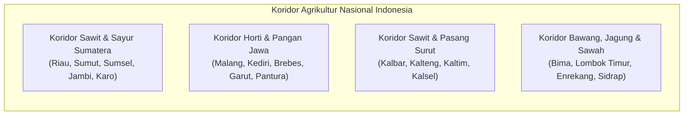

# Spesifikasi Riset Validasi Pasar, Demografi Sentra Pertanian Indonesia & Rantai Pasok Retail Kios Saprotan — Agrimarket

**Dokumen Kontrak:** `docs/spec/MARKET-VALIDATION-DEMOGRAPHICS-RESEARCH.md`  
**Staging Ref:** `~/Documents/work/prd/agrimarket/MARKET-VALIDATION-DEMOGRAPHICS-RESEARCH.md`  
**Versi:** 2.0.0 — 2026-09-24  
**Otoritas:** Tim Riset Pasar Agribisnis, Kanal Distribusi Retail, & Demografi Lapangan Agrimarket  
**Cakupan Wilayah:** 100% Pasar Domestik Indonesia (Zero Malaysia), 38 Provinsi, 514 Kabupaten/Kota, Jaringan Kios Saprotan (KPL & Retailer Swasta)

---

## 1. Validasi Pasar Domestik & Strategic Rationale (100% Pasar Indonesia)

Indonesia merupakan raksasa agrikultur tropis dunia dengan luas lahan baku sawah 7.46 juta hektar, areal perkebunan kelapa sawit 16.83 juta hektar, serta ratusan ribu hektar sentra hortikultura intensif dataran tinggi dan rendah. Kebutuhan input nutrisi khusus, stimulator pertumbuhan, dan perisai penyakit tanaman di tingkat petani domestik terus meningkat seiring degradasi tanah dan anomali cuaca BMKG.

Berdasarkan arahan strategis kepemimpinan, Agrimarket **berfokus 100% pada pasar domestik Indonesia**:
- Seluruh materi riset, dialek komunikasi petani, istilah agronomi lapang, dan penetrasi distribusi diarahkan secara presisi ke pulau Jawa, Sumatera, Kalimantan, Sulawesi, Bali, dan Nusa Tenggara.
- Seluruh referensi pasar luar negeri (termasuk Malaysia) telah dieliminasi total untuk memastikan keselarasan regulasi Kementan, karakter sosio-kultural petani lokal, dan dinamika rantai pasok kios saprotan desa.

---

## 2. Pemetaan Geografis Sentra Produksi & Koridor Ekspansi Nasional

### 2.1. Koridor Perkebunan Sawit Nasional (Sumatera & Kalimantan)
Merupakan pasar utama untuk produk **AUSSIE Sawit** (pengendalian jamur Ganoderma / Busuk Pangkal Batang dan pemulihan stres kekeringan):
1. **Provinsi Riau (3.38 Juta Ha Sawit):**
   - *Kabupaten Sentra Utama:* Kampar, Rokan Hulu, Rokan Hilir, Siak, Pelalawan, Indragiri Hulu, Kuantan Singingi.
   - *Karakter Tanah & Iklim:* Tanah gambut dangkal hingga sedang (*saprik/hemik*) dan ultisol; ancaman Ganoderma endemik pada kebun kelapa sawit generasi kedua (*replanting*).
2. **Provinsi Sumatera Utara (2.12 Juta Ha Sawit):**
   - *Kabupaten Sentra Utama:* Labuhanbatu, Labuhanbatu Utara, Asahan, Simalungun, Deli Serdang, Langkat.
   - *Karakter:* Sentra perkebunan sawit tertua di Indonesia; tingkat keparahan infeksi jamur Ganoderma tertinggi di Asia Tenggara.
3. **Provinsi Sumatera Selatan (1.52 Juta Ha Sawit):**
   - *Kabupaten Sentra Utama:* Banyuasin, Musi Banyuasin, Ogan Komering Ilir (OKI), Muara Enim, Lahat.
4. **Provinsi Jambi (1.18 Juta Ha Sawit):**
   - *Kabupaten Sentra Utama:* Muaro Jambi, Tanjung Jabung Barat, Merangin, Batanghari.
5. **Provinsi Kalimantan Barat (2.10 Juta Ha Sawit):**
   - *Kabupaten Sentra Utama:* Ketapang, Sintang, Sanggau, Landak, Sambas.
6. **Provinsi Kalimantan Tengah (2.35 Juta Ha Sawit):**
   - *Kabupaten Sentra Utama:* Kotawaringin Barat (Pangkalan Bun), Kotawaringin Timur (Sampit), Seruyan, Katingan.
7. **Provinsi Kalimantan Timur (1.45 Juta Ha Sawit):**
   - *Kabupaten Sentra Utama:* Kutai Kartanegara, Paser, Berau, Kutai Timur.

### 2.2. Koridor Hortikultura Intensif Nasional (Jawa, Bali, NTB, Sulsel)
Merupakan pasar utama untuk produk **BENSU Hortikultura** dan **SARATOGA Plant Serum**:
1. **Jawa Timur (Sentra Cabai, Bawang Merah, Tomat & Semangka):**
   - *Kabupaten Sentra Utama:* Malang (Pujon, Ngantang, Poncokusumo), Kediri (Pare, Kepung), Banyuwangi (Wongsorejo, Rogojampi), Nganjuk (Rejoso, Sukomoro - Raja Bawang), Blitar, Probolinggo.
   - *Karakter:* Petani komersial berani modal tinggi, rotasi tanam intensif 3–4 kali setahun.
2. **Jawa Tengah (Sentra Bawang Merah, Kentang & Sayuran Dataran Tinggi):**
   - *Kabupaten Sentra Utama:* Brebes (Larangan, Wanasari - Ibukota Bawang Merah), Temanggung, Magelang (Bandongan, Sawangan), Wonosobo & Banjarnegara (Dataran Tinggi Dieng), Boyolali (Selo).
3. **Jawa Barat (Sentra Sayuran Daun, Cabai & Tomat Bandung Raya):**
   - *Kabupaten Sentra Utama:* Garut (Cikajang, Bayongbong), Bandung (Pangalengan, Ciwidey, Lembang), Cianjur (Pacet, Cipanas), Majalengka (Argapura).
4. **Nusa Tenggara Barat (Sentra Bawang Merah & Cabai Musim Kering):**
   - *Kabupaten Sentra Utama:* Lombok Timur (Sembalun - Horti Dataran Tinggi Kaki Rinjani), Bima (Sape, Woha - Bawang Merah Nasional), Sumbawa.
5. **Sulawesi Selatan (Sentra Sayuran Gunung & Bawang):**
   - *Kabupaten Sentra Utama:* Enrekang (Kecamatan Anggeraja, Baraka, Malua), Gowa (Malino, Tinggimoncong), Jeneponto.
6. **Bali (Sentra Sayur & Horti Buah):**
   - *Kabupaten Sentra Utama:* Tabanan (Baturiti, Bedugul), Bangli (Kintamani).

### 2.3. Koridor Pangan Strategis Nasional & Food Estate (Padi & Jagung)
Merupakan pasar utama untuk produk **KOJIEN Activator** dan **SARATOGA Plant Serum**:
1. **Jalur Pantura Jawa Barat:** Karawang, Subang, Indramayu, Cirebon (Lumbung Padi Nasional Irigasi Teknis).
2. **Jalur Tengah Jawa Tengah:** Grobogan (Sentra Jagung Terbesar), Sragen, Klaten, Demak.
3. **Jalur Tapal Kuda & Barat Jawa Timur:** Ngawi, Lamongan, Bojonegoro, Tuban, Jember.
4. **Jalur Pangan Sulawesi Selatan:** Sidrap, Pinrang, Bone, Wajo.
5. **Koridor Food Estate Strategis:** Merauke (Papua Selatan), Kapuas & Pulang Pisau (Kalteng).

---

## 3. Matriks 3 Buyer Persona Petani Indonesia Mendalam

### Persona 1: "Pak Haji Sawit Swadaya" — Pemilik Kebun Perkebunan Mandiri
- **Profil Demografis:** Pria, usia 42–60 tahun, berdomisili di Riau, Sumut, Sumsel, atau Kalteng.
- **Skala Lahan:** Memiliki kebun sawit swadaya 10 – 50 Hektar (bukan buruh harian / bukan petani plasma korporasi penuh).
- **Karakter Psikografis:** Sangat protektif terhadap aset pohon sawitnya; memandang kebun sawit sebagai investasi pensiun dan warisan keluarga; memiliki modal mandiri dari penjualan TBS dua mingguan ke RAM/Pabrik Kelapa Sawit (PKS).
- **Ketakutan Terbesar (Core Fear):** Infeksi jamur Ganoderma yang menyebar dari satu pohon ke blok kebun lain, pohon tumbang mendadak, serta penurunan tonase TBS dari 2.5 ton/Ha menjadi < 1 ton/Ha saat musim kemarau.
- **Aspirasi Tertinggi (Core Desire):** Pohon sawit berumur panjang (> 25 tahun), pelepah tetap membuka hijau segar, dan TBS berbobot berat (rendemen minyak tinggi di PKS).
- **Pemicu Belanja (Buying Motivator):** Bukti nyata pohon sakit yang sebelumnya sengkleh dan berjamur bisa diselamatkan tanpa perlu ditumbang/dicongkel alat berat (yang memakan biaya Rp 250.000 per pokok).
- **Produk Relevan:** `AUSSIE Sawit` (Paket Kemasan 4 Liter Jerigen).

### Persona 2: "Mas Petani Horti Komersial" — Petani Sayuran & Buah Berani Modal
- **Profil Demografis:** Pria/Wanita, usia 28–48 tahun, berdomisili di Brebes, Malang, Kediri, Garut, atau Sembalun Lombok.
- **Skala Lahan:** 0.5 – 3 Hektar (Lahan milik sendiri atau sewa tahunan).
- **Karakter Psikografis:** Dinamis, melek teknologi smartphone (aktif di grup Facebook Petani Cabai, TikTok Pertanian, dan WhatsApp Komunitas), berorientasi pada kecepatan ROI dan harga cabai di pasar induk Kramat Jati / Pasar Induk Osowilangun.
- **Ketakutan Terbesar (Core Fear):** Penyakit patek antraknosa menghabisi buah cabai dalam waktu 3 hari saat panen raya, serta kerontokan bunga massal saat harga cabai sedang melonjak di atas Rp 50.000/kg.
- **Aspirasi Tertinggi (Core Desire):** Tanaman berbuah lebat tanpa henti (*panen petikan awet hingga 30+ kali*), kulit buah mengilap tebal tidak gampang busuk saat dikirim antarpulau, dan menjadi rujukan petani lain di desanya.
- **Pemicu Belanja (Buying Motivator):** Penjelasan teknis bahan aktif yang jelas (tidak suka klaim gaib/bohong), bukti ubinan nyata, dan ketersediaan barang di kios terdekat.
- **Produk Relevan:** `BENSU Hortikultura` (Fase Awal) + `SARATOGA Plant Serum` (Fase Generatif).

### Persona 3: "Bapak Petani Padi & Jagung Sawah" — Petani Pangan Tangguh
- **Profil Demografis:** Pria, usia 35–58 tahun, berdomisili di Karawang, Indramayu, Grobogan, Lamongan, atau Sidrap.
- **Skala Lahan:** 1 – 5 Hektar (Sawah irigasi teknis / tadah hujan).
- **Karakter Psikografis:** Sangat menghormati anjuran ketua kelompok tani (Poktan) dan PPL Dinas Pertanian; kalkulatif dalam menghitung biaya per tangki semprot; loyal pada merek obat yang sudah terbukti.
- **Ketakutan Terbesar (Core Fear):** Tanaman padi roboh/rebah diterpa angin hujan menjelang panen, serta bulir gabah hampa melompong akibat jamur patah leher (*blast*) yang membuat harga tebasan anjlok.
- **Aspirasi Tertinggi (Core Desire):** Batang padi tegak kokoh sampai sabit panen memotong, bulir gabah padat bernas kuning mengilap hingga ke pangkal malai, dan timbangan gabah kering panen (GKP) tembus di atas 7.5 ton/Ha.
- **Pemicu Belanja (Buying Motivator):** Harga terjangkau per tangki (efisiensi biaya input), rekomendasi pemilik kios saprotan langganan, dan kepastian izin kementan resmi.
- **Produk Relevan:** `KOJIEN Activator` + `SARATOGA Plant Serum`.

---

## 4. Struktur Rantai Pasok Retail Kios Saprotan (KPL & Retailer Swasta)

Di Indonesia, keputusan akhir penebusan produk agrokimia 70% ditentukan di meja kasir kios saprotan desa.

### 4.1. Struktur Margin Rantai Nilai Distribusi
| Lini Distribusi | Peran & Tanggung Jawab | Margin Keuntungan Rata-Rata | Model Transaksi |
| :--- | :--- | :--- | :--- |
| **Produsen (Agrimarket)** | Riset formulasi, registrasi kementan, branding digital & demand pull | Margin Kotor 45 – 55% | Kontrak Supply & Buffer Stock |
| **Distributor Provinsi / Sub-Distributor** | Logistik pergudangan antarkota, pembiayaan stok wilayah | Margin 8 – 12% | Tunai / Kredit Giro 30–60 Hari |
| **Kios Saprotan (Retailer Desa / KPL)** | Menjual langsung ke petani, memberi edukasi teknis takaran dosis | Margin 18 – 25% | Tunai / Kredit Yarnen ke Petani |
| **Petani Konsumen Akhir** | Mengaplikasikan produk pada tanaman di lahan | Nilai ROI Tambahan Panen 300–600% | Pembelian Tunai / Bayar Panen (*Yarnen*) |

### 4.2. Karakteristik Model Transaksi Petani ke Kios: Tunai vs Yarnen
1. **Model Pembelian Tunai (*Cash on Delivery* / Diskon Kios):**
   - Dominan pada petani hortikultura komersial (cabai, melon, bawang) yang memiliki arus kas mingguan dari hasil petikan.
   - Petani bersedia membayar tunai jika kios memberikan diskon 3–5% atau bonus kaos/topi agrimarket.
2. **Model Kredit Musiman (*Yarnen* — Bayar Panen):**
   - Dominan pada petani pangan padi dan jagung (sekitar 55–65% transaksi di tingkat desa).
   - Pemilik kios menalangi obat dan pupuk selama 3–4 bulan, lalu petani melunasi saat gabah dipanen dan dibeli penebas.
   - Kios membebankan margin sedikit lebih tinggi (+10–15%) untuk menanggung risiko gagal panen.

### 4.3. Strategi Penetrasi "Kios-Pull" Melalui Integrasi Digital
Agrimarket menerapkan strategi *Pull Marketing* terbalik:
1. Iklan Meta Ads membidik petani di radius kabupaten sentra aktif.
2. Petani tertarik dan mengklik tombol WhatsApp untuk berkonsultasi mengenai dosis tangki.
3. Tim CS / Agronomis Agrimarket memberikan resep dan menanyakan lokasi desa petani.
4. Tim CS mengarahkan petani: *"Pak, barang ready di Kios Tani Makmur, dekat pasar kecamatan bapak. Nanti tunjukkan pesan WhatsApp ini untuk dapat harga paket resmi."*
5. Di saat yang sama, tim sales lapangan mendatangi Kios Tani Makmur: *"Pak Kios, ini ada 5 petani bapak yang mau ambil SARATOGA & KOJIEN hari ini. Kita drop stok 2 karton ya."*
6. Dengan model ini, kios tidak pernah menolak dititipi produk karena **permintaan petani riil sudah menunggu di depan pintu**.
