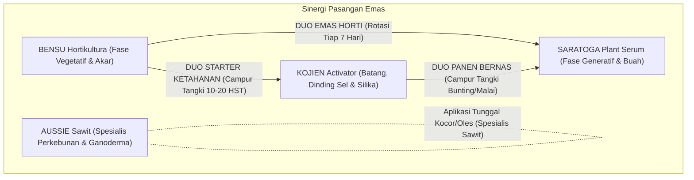

# Spesifikasi Riset Mendalam Kamus Playbook Diagnostik Lapangan & Matriks Sinergi Mix & Match Agrokimia — Agrimarket

**Dokumen Kontrak:** `docs/spec/MIX-MATCH-FIELD-PLAYBOOK-RESEARCH.md`  
**Staging Ref:** `~/Documents/work/prd/agrimarket/MIX-MATCH-FIELD-PLAYBOOK-RESEARCH.md`  
**Versi:** 2.0.0 — 2026-09-24  
**Otoritas:** Tim Agronomi Lapangan, Formulator Bio-Kimiawi, & Technical Services Agrimarket  
**Cakupan Materi:** 15 Kasus Diagnostik Lapangan, 4-SKU Synergy Matrix, 5 Protokol Baku Rotasi, Standar Keamanan Tangki WALES, SOP Jar-Test & Model Kalkulator Dosis

---

## 1. Landasan Teori Sinergi Fisiologis & Kompatibilitas Agrokimia

Dalam praktik budidaya agrikultur intensif di Indonesia, petani kerap melakukan pencampuran (*tank-mixing*) berbagai bahan aktif secara spekulatif (*cocktail mixing*). Akibatnya sering terjadi:
1. **Inkompatibilitas Fisik & Kimiawi:** Penggumpalan (*precipitation*), sedimentasi seperti keju, atau kenaikan panas eksotermis yang menyumbat nozzle sprayer dan merusak molekul bio-stimulan.
2. **Antagonisme Ionik & Fitotoksisitas:** Pencampuran ion logam berat (seperti tembaga konsentrasi tinggi) dengan asam amino murni menyebabkan denaturasi rantai peptida dan memicu bercak luka bakar pada daun muda (*leaf scorch*).
3. **Ketidaksesuaian Fase Fenologis (*Mismatched Phenology*):** Mengaplikasikan nutrisi pemacu vegetatif nitrogen tinggi saat tanaman sedang inisiasi bunga memicu kerontokan bunga massal (*flower shedding*).

Agrimarket merumuskan **Filosofi Tiga Pilar Sinergi Agrokimia Presisi**:
- **Sinergisme Simultan (Simultaneous Tank-Mix):** Formula yang saling melengkapi mekanisme serapannya tanpa bereaksi secara kimiawi (misal: bio-silika KOJIEN yang memperkuat kutikula sehingga memudahkan deposisi kalium karboksilat SARATOGA pada dinding sel buah).
- **Rotasi Sekuensial Berbasis HST (Sequential Phase Rotation):** Memisahkan aplikasi produk berdasarkan fase perkembangan tanaman (misal: BENSU pada fase vegetatif 0–35 HST, dilanjutkan SARATOGA pada fase generatif 35–70 HST).
- **Protokol Tangki Mandiri (Solo Targeted Application):** Produk khusus dengan peruntukan organ spesifik (misal: AUSSIE Sawit yang diaplikasikan ke pangkal batang dan zona perakaran piringan sawit, tanpa dicampur pupuk daun mikro pekat).

---

## 2. Ensiklopedia Kamus Playbook Diagnostik 15 Kasus Lapangan

Berikut adalah dokumentasi 15 kasus masalah tanaman representatif yang tervalidasi di lapangan:

### PB-HORTI-01: Daun Keriting, Mandek & Klorosis Kuning Pasca Cuaca Ekstrem
- **Kategori Masalah:** Daun & Vegetatif | **Tingkat Keparahan:** Level Sedang
- **Komoditas Rentan:** Cabai Rawit, Cabai Besar, Tomat, Terung, Paprika
- **Gejala Visual di Kebun:** Pucuk daun melengkung ke atas (*cupping*), helai daun menguning kusam di antara tulang daun (klorosis interveinal), ruas batang memendek, dan titik tumbuh macet/mandek pasca serangan trips atau transisi cuaca mendadak.
- **Akar Masalah Bio-Fisiologis:** Rusaknya membran sel kloroplas dan terhambatnya sintesis auksin akibat serangan hama pengisap serta fluktuasi suhu ekstrem siang-malam (> 12°C).
- **Pemicu Cuaca:** Pancaroba I (April–Mei) & Pancaroba II (September–Oktober).
- **Resep Sinergi Produk:** `BENSU Hortikultura` (Hero) + `SARATOGA Serum` (Partner Rotasi)
  - *Mekanisme:* L-asam amino peptida dan vitamin B BENSU meregenerasi kloroplas yang rusak; mikro-kelat memacu auksin meristem untuk membuka daun baru yang segar.
- **Protokol Resep Dokter:**
  - *Dosis per 16L Tangki:* 30 ml BENSU + 20 ml SARATOGA
  - *Dosis per Hektar:* 450 ml BENSU + 300 ml SARATOGA (Volume air 240 Liter/Ha)
  - *Metode Aplikasi:* Semprot kabut merata ke seluruh daun bawah dan pucuk
  - *Waktu Semprot Terbaik:* Pagi hari pukul 06.00 – 08.30 WIB saat stomata terbuka
  - *Interval & Putaran:* Tiap 5 hari sekali, ulangi sebanyak 3 putaran
  - *SLA Pemulihan Visual:* 7–10 Hari (Pucuk baru mulai membuka hijau segar)
- **Keamanan Tangki:** COMPATIBLE (Boleh dicampur langsung dalam satu tangki; tambahkan perekat non-ionik dosis rendah).
- **Playbook Kios & Iklan:**
  - *Headline Meta Ads:* "Pucuk Cabai Keriting & Mandek Pasca Cuaca Ekstrem? Semprot Formula Pemulih Klorofil Ini!"
  - *Arahan Kios:* Edukasi petani agar tidak langsung memborbardir pestisida kimia pekat saat tanaman stres; pulihkan dulu metabolisme selnya dengan asam amino BENSU.

### PB-HORTI-02: Patek Antraknosa Buah Busuk & Kulit Lembek Musim Rendeng
- **Kategori Masalah:** Penyakit & Jamur | **Tingkat Keparahan:** Level Kritis
- **Komoditas Rentan:** Cabai Rawit, Cabai Merah Keriting, Tomat, Bawang Merah
- **Gejala Visual di Kebun:** Bercak cokelat kehitaman melingkar konsentris melekuk ke dalam pada buah cabai, kulit buah melunak berair, timbul massa spora oranye/merah muda di tengah bercak, buah rontok massal sebelum masak.
- **Akar Masalah Bio-Fisiologis:** Infeksi jamur *Colletotrichum capsici* yang melarutkan pektin dinding sel kulit buah pada kelembaban udara jenuh (> 85% RH) dan suhu hangat (28–32°C).
- **Pemicu Cuaca:** Puncak Musim Hujan Rendeng (Desember–Februari).
- **Resep Sinergi Produk:** `KOJIEN Activator` (Hero) + `SARATOGA Serum` (Partner)
  - *Mekanisme:* Orthosilicic Acid KOJIEN mempertebal dinding sel kutikula buah sehingga hifa jamur gagal menembus; fitoaleksin mensterilkan jaringan internal; kalsium SARATOGA mengikat pektin agar kulit buah liat.
- **Protokol Resep Dokter:**
  - *Dosis per 16L Tangki:* 25 ml KOJIEN + 20 ml SARATOGA
  - *Dosis per Hektar:* 400 ml KOJIEN + 300 ml SARATOGA
  - *Metode Aplikasi:* Semprot kabut bertekanan merata, fokus pada dompolan buah
  - *Waktu Semprot Terbaik:* Sore hari pukul 15.30 – 17.30 WIB atau pagi sebelum terik
  - *Interval & Putaran:* Tiap 4 hari sekali saat hujan lebat, ulangi 3 putaran
  - *SLA Pemulihan Visual:* 5–7 Hari (Penyebaran bercak patek baru terhenti total)
- **Keamanan Tangki:** COMPATIBLE (Boleh dicampur fungisida mankozeb atau azoksistrobin; DILARANG dicampur fungisida tembaga hidroksida pekat).
- **Playbook Kios & Iklan:**
  - *Headline Meta Ads:* "Cegah Petikan Cabai Rusak Akibat Patek Antraknosa di Musim Rendeng!"
  - *Arahan Kios:* Anjurkan kombinasi KOJIEN + SARATOGA sebagai perlindungan dinding sel buah sebelum spora jamur membusukkan seluruh hasil petikan.

### PB-HORTI-03: Rontok Bunga Massal & Pentil Buah Kuning Kempes
- **Kategori Masalah:** Bunga & Buah | **Tingkat Keparahan:** Level Kritis
- **Komoditas Rentan:** Cabai, Tomat, Melon, Semangka, Jeruk, Mangga
- **Gejala Visual di Kebun:** Tangkai bunga menguning pada cincin absisi, bunga gugur sebelum penyerbukan sempurna, pentil buah muda menguning lalu kempes dan rontok saat disentuh.
- **Akar Masalah Bio-Fisiologis:** Lonjakan hormon etilen akibat stres suhu panas di atas 34°C atau kelebihan nitrogen saat fase generatif awal; defisiensi boron dan kalsium terlarut.
- **Pemicu Cuaca:** Puncak Kemarau El Niño (Juli–Agustus) & Pancaroba Panas.
- **Resep Sinergi Produk:** `SARATOGA Serum` (Hero) + `BENSU Hortikultura` (Partner Rotasi)
  - *Mekanisme:* L-Prolin dan polifenol SARATOGA memblokir pembentukan lapisan absisi etilen; boron-etanolamin memanjangkan tabung polen; kalsium mengunci pentil buah.
- **Protokol Resep Dokter:**
  - *Dosis per 16L Tangki:* 25 ml SARATOGA (Aplikasi Utama)
  - *Dosis per Hektar:* 375 ml SARATOGA (15 Tangki / Ha)
  - *Metode Aplikasi:* Semprot kabut halus merata pada tajuk bunga di pagi hari
  - *Waktu Semprot Terbaik:* Pagi hari pukul 06.00 – 08.00 WIB sebelum bunga menutup
  - *Interval & Putaran:* Tiap 7 hari sekali, minimal 3 putaran sepanjang fase mekar
  - *SLA Pemulihan Visual:* 4–6 Hari (Gugur bunga berhenti drastis > 80%)
- **Keamanan Tangki:** COMPATIBLE (Hindari penyemprotan bertekanan kasar langsung ke putik bunga).
- **Playbook Kios & Iklan:**
  - *Headline Meta Ads:* "Bunga Cabai & Tomat Berguguran? Kunci Tangkai Bunga dengan Serum Japanese Pro-Plant!"
  - *Arahan Kios:* Ingatkan petani bahwa kerontokan bunga adalah kerugian tonase paling mahal; SARATOGA menjaga bunga tetap menempel dan menjadi buah bernas.

### PB-PADI-04: Rebah Batang Padi & Malai Patah Leher Akibat Angin Kencang
- **Kategori Masalah:** Batang & Akar | **Tingkat Keparahan:** Level Kritis
- **Komoditas Rentan:** Padi Sawah Irigasi, Padi Gogo, Jagung Hibrida
- **Gejala Visual di Kebun:** Batang tanaman padi melengkung roboh ke tanah saat mendekati panen; tangkai malai patah menghitam (*neck blast*); gabah terendam lumpur air sawah dan berkecambah.
- **Akar Masalah Bio-Fisiologis:** Dinding sel jerami rapuh akibat pemupukan urea (N) berlebih dan kekurangan silika; serangan jamur *Pyricularia oryzae* pada buku malai.
- **Pemicu Cuaca:** Angin Monsun Barat & Hujan Lebat Musim Rendeng (Januari–Februari).
- **Resep Sinergi Produk:** `KOJIEN Activator` (Hero) + `SARATOGA Serum` (Partner)
  - *Mekanisme:* Orthosilicic acid KOJIEN mempertebal berkas sklerenkim batang hingga sekuat kawat; SARATOGA memadatkan bobot gabah tanpa membebani elastisitas batang.
- **Protokol Resep Dokter:**
  - *Dosis per 16L Tangki:* 25 ml KOJIEN + 20 ml SARATOGA
  - *Dosis per Hektar:* 400 ml KOJIEN + 300 ml SARATOGA
  - *Metode Aplikasi:* Semprot merata pada batang bawah dan seluruh daun bendera
  - *Waktu Semprot Terbaik:* Fase bunting akhir (45 HST) dan malai keluar 70% (65 HST)
  - *Interval & Putaran:* 2 kali aplikasi strategis
  - *SLA Pemulihan Visual:* 7 Hari (Batang teraba kaku keras, daun bendera tegak)
- **Keamanan Tangki:** COMPATIBLE (Dapat dicampur fungisida trisiklazol / difenokonazol).
- **Playbook Kios & Iklan:**
  - *Headline Meta Ads:* "Amankan Padi Menjelang Panen! Batang Kokoh Tegak Anti-Rebah Diterpa Hujan Badai!"
  - *Arahan Kios:* Rekomendasikan KOJIEN saat petani membeli pupuk susulan kedua (30–40 HST) agar batang kokoh sebelum malai terisi berat.

### PB-SAWIT-05: Busuk Pangkal Batang & Serangan Jamur Ganoderma Sawit
- **Kategori Masalah:** Penyakit & Jamur | **Tingkat Keparahan:** Level Kritis
- **Komoditas Rentan:** Kelapa Sawit (Tanaman Menghasilkan TM & TBM)
- **Gejala Visual di Kebun:** Daun tombak tidak membuka lebih dari 3 helai, pelepah tua sengkleh patah menggantung di sekeliling batang bawah, muncul tubuh buah jamur kipas (*basidiocarp*) Ganoderma di pangkal batang, pohon tumbang mendadak.
- **Akar Masalah Bio-Fisiologis:** Penetrasi hifa jamur *Ganoderma boninense* merusak pembuluh xilem di pangkal batang, mematikan translokasi air dan nutrisi dari akar ke mahkota tajuk.
- **Pemicu Cuaca:** Sepanjang Tahun, memuncak pada Musim Hujan Aktif (Oktober–Januari).
- **Resep Sinergi Produk:** `AUSSIE Sawit` (Hero Tunggal Kuratif)
  - *Mekanisme:* Kalium fosfit sistemik dua arah menghentikan perluasan miselium jamur; asam salisilat memicu SAR pertahanan jaringan kayu; asam humat memulihkan mikrobioma tanah piringan.
- **Protokol Resep Dokter:**
  - *Dosis per Pokok:* Kocor 80 ml AUSSIE dilarutkan dalam 10 Liter air per pokok pada piringan radius 1.5 meter.
  - *Bedah Jaringan:* Bersihkan tubuh buah jamur dan jaringan kayu lunak, oleskan AUSSIE murni kental pada luka batang.
  - *Metode Aplikasi:* Kocor tanah piringan + oles batang
  - *Interval & Putaran:* Tiap 14 hari sekali, minimal 3 putaran kuratif
  - *SLA Pemulihan Visual:* 21–30 Hari (Pelepah baru membuka hijau segar, busuk kering)
- **Keamanan Tangki:** APLIKASI TUNGGAL (Tidak disarankan dicampur pestisida kimia lain saat pengocoran tanah).
- **Playbook Kios & Iklan:**
  - *Headline Meta Ads:* "Selamatkan Kebun Sawit dari Ancaman Ganoderma! Pulihkan Pohon Sakit Tanpa Tumbang!"
  - *Arahan Kios:* Edukasi pemilik kebun swadaya untuk mendeteksi gejala sejak dini (pelepah sengkleh) sebelum batang keropos berongga.

### PB-PADI-06: Gabah Hampa Padi, Daun Bendera Kering & Jamur Blast
- **Kategori Masalah:** Bunga & Buah | **Tingkat Keparahan:** Level Kritis
- **Komoditas Rentan:** Padi Sawah, Padi Gogo
- **Gejala Visual di Kebun:** Bulir gabah berwarna kusam keabuan, sebagian besar bulir hampa (*gabah melompong*), daun bendera mengering terbakar sebelum pengisian selesai.
- **Akar Masalah:** Defisiensi kalium bio-terserap pada fase pengisian susu dan infeksi *Pyricularia oryzae* pada tangkai bulir.
- **Pemicu Cuaca:** Akhir Rendeng / Pancaroba I (Februari–April).
- **Resep Sinergi Produk:** `SARATOGA Serum` (Hero) + `KOJIEN Activator` (Partner)
  - *Dosis:* 25 ml SARATOGA + 20 ml KOJIEN / 16L air. Aplikasi saat bunting tua (55 HST) dan pengisian bulir (70 HST). SLA: 7 hari.

### PB-HORTI-07: Buah Pecah (*Fruit Cracking*) & Busuk Ujung (*Blossom End Rot*)
- **Kategori Masalah:** Bunga & Buah | **Tingkat Keparahan:** Level Sedang
- **Komoditas Rentan:** Tomat, Cabai, Semangka, Melon
- **Gejala Visual di Kebun:** Ujung buah tomat/cabai menghitam cekung kering; kulit melon dan semangka retak memanjang menjelang matang.
- **Akar Masalah:** Ketidakstabilan pasokan air (kekeringan disusul hujan lebat) menyebabkan translokasi kalsium terhenti mendadak.
- **Pemicu Cuaca:** Pancaroba Ekstrem (April & Oktober).
- **Resep Sinergi Produk:** `SARATOGA Serum` (Hero). Kalsium-gula alkohol mobile SARATOGA langsung mengalir ke sel buah muda. Dosis 25 ml / 16L air, interval 7 hari.

### PB-HORTI-08: Layu Bakteri & Layu Fusarium di Bedengan Tergenang
- **Kategori Masalah:** Batang & Akar | **Tingkat Keparahan:** Level Kritis
- **Komoditas Rentan:** Cabai, Tomat, Bawang Merah, Kentang
- **Gejala Visual di Kebun:** Tanaman layu mendadak di siang terik namun tampak segar di pagi hari; pembuluh batang bawah kecokelatan; perakaran membusuk hitam berbau masam.
- **Akar Masalah:** Infeksi bakteri *Ralstonia solanacearum* atau jamur *Fusarium oxysporum* pada tanah asam tergenang.
- **Pemicu Cuaca:** Awal Musim Hujan Rendeng (Oktober–Desember).
- **Resep Sinergi Produk:** `BENSU Hortikultura` + `KOJIEN Activator` (Kocor Pangkal Batang). Dosis 30 ml BENSU + 25 ml KOJIEN / 16L air, kocor 200 ml per lubang tanam.

### PB-BAWANG-09: Moler Bawang Merah (Inul) & Umbi Kecil Kering
- **Kategori Masalah:** Penyakit & Jamur | **Tingkat Keparahan:** Level Kritis
- **Komoditas Rentan:** Bawang Merah
- **Gejala Visual di Kebun:** Daun terpelintir memanjang meliuk-liuk (*nginul*), tanaman rebah lemas, umbi tidak membesar dan membusuk dari leher batang.
- **Akar Masalah:** Infeksi *Fusarium oxysporum f.sp. cepae* yang dipicu kelembaban tanah jenuh dan pemupukan nitrogen nitrat berlebih.
- **Pemicu Cuaca:** Musim Hujan Rendeng (Desember–Januari).
- **Resep Sinergi Produk:** `KOJIEN Activator` + `BENSU Hortikultura`. Dosis 20 ml KOJIEN + 25 ml BENSU / 16L air, semprot tiap 5 hari pada 15–35 HST.

### PB-JAGUNG-10: Bulai Jagung & Tongkol Kecil Biji Ompong
- **Kategori Masalah:** Penyakit & Jamur | **Tingkat Keparahan:** Level Kritis
- **Komoditas Rentan:** Jagung Hibrida, Jagung Manis
- **Gejala Visual di Kebun:** Daun bergaris-garis putih kuning klorotik dari pangkal, tanaman kerdil kaku, tongkol tidak terisi biji penuh (*ompong*).
- **Akar Masalah:** Jamur sistemik *Peronosclerospora maydis* yang menginfeksi meristem daun muda saat perkecambahan.
- **Pemicu Cuaca:** Awal Musim Tanam MT 1 & MT 2.
- **Resep Sinergi Produk:** `KOJIEN Activator` (Perlakuan Benih & Semprot Awal) + `SARATOGA Serum` (Fase Bunga Tongkol). Dosis perlakuan benih 10 ml/kg benih; semprot 25 ml KOJIEN pada 15 & 28 HST.

### PB-MELON-11: Daun Terbakar (*Sunscald*) & Brix Gula Rendah saat El Niño
- **Kategori Masalah:** Bunga & Buah | **Tingkat Keparahan:** Level Sedang
- **Komoditas Rentan:** Melon Golden, Semangka Non-Biji
- **Gejala Visual di Kebun:** Kulit buah sisi atas memutih terbakar sinar matahari; daging buah tawar dengan brix < 10%; jaring (*net*) melon tidak terbentuk sempurna.
- **Akar Masalah:** Radiasi UV ekstrem dan evaporasi tinggi yang merusak enzim pembentuk sukrosa saat puncak kemarau El Niño.
- **Pemicu Cuaca:** Puncak Kemarau Kering (Juli–Agustus).
- **Resep Sinergi Produk:** `SARATOGA Serum` (Hero). Dosis 30 ml / 16L air tiap 6 hari pada fase pembentukan jaring (40–60 HST). Meningkatkan brix hingga 13–15%.

### PB-SAWIT-12: Daun Tombak Mandek & Bunga Jantan Dominan Pasca Defisit Air
- **Kategori Masalah:** Daun & Vegetatif | **Tingkat Keparahan:** Level Sedang
- **Komoditas Rentan:** Kelapa Sawit
- **Gejala Visual di Kebun:** Daun tombak menumpuk 3-4 helai tidak mau mekar; tandan buah segar (TBS) turun drastis dan hanya memproduksi bunga jantan.
- **Akar Masalah:** Cekaman kekeringan berkepanjangan (> 3 bulan defisit air) memicu hormon asam abkisat (ABA) endogen tinggi.
- **Pemicu Cuaca:** Kemarau Panjang El Niño (Juli–September).
- **Resep Sinergi Produk:** `AUSSIE Sawit`. Kocor piringan 60 ml / pokok saat hujan pertama turun. Memacu pembentukan bunga betina dan membuka daun tombak.

### PB-HORTI-13: Tanaman Kuning Kerdil Pasca Terendam Banjir Sawah
- **Kategori Masalah:** Batang & Akar | **Tingkat Keparahan:** Level Kritis
- **Komoditas Rentan:** Cabai, Bawang Merah, Jagung
- **Gejala Visual di Kebun:** Seluruh daun pucat kekuningan merata, tanaman mandek tidak bertunas, akar serabut membusuk cokelat lunak pasca genangan air surut.
- **Akar Masalah:** Kondisi tanah anoksia (tanpa oksigen) yang mematikan respirasi sel akar dan memicu akumulasi gas beracun (H₂S, metana).
- **Pemicu Cuaca:** Banjir Luapan Sungai / Hujan Ekstrem Rendeng (Januari).
- **Resep Sinergi Produk:** `BENSU Hortikultura` (Kocor & Semprot Daun). Dosis 40 ml / 16L air segera setelah air surut, ulangi tiap 4 hari sebanyak 3 putaran.

### PB-HORTI-14: Daun Bawah Menguning Cepat & Gugur Prematur saat Berbuah Lebat
- **Kategori Masalah:** Daun & Vegetatif | **Tingkat Keparahan:** Level Sedang
- **Komoditas Rentan:** Tomat, Cabai, Terung, Kentang
- **Gejala Visual di Kebun:** Daun-daun tua di bawah kanopi menguning dari tepi merambat ke dalam lalu rontok massal saat tanaman sedang sarat buah.
- **Akar Masalah:** Translokasi nitrogen, magnesium, dan kalium ditarik paksa menuju pembesaran buah (*nutrient scavenging*), mengorbankan daun tua.
- **Pemicu Cuaca:** Fase Beban Buah Puncak (Sepanjang Tahun).
- **Resep Sinergi Produk:** `BENSU Hortikultura` + `SARATOGA Serum`. Dosis 20 ml BENSU + 20 ml SARATOGA / 16L air tiap 7 hari. Menjaga kanopi daun tetap hijau hingga petikan akhir.

### PB-TRANSPLANT-15: Stres Pindah Tanam (*Transplant Shock*) & Bibit Loyo
- **Kategori Masalah:** Batang & Akar | **Tingkat Keparahan:** Level Preventif
- **Komoditas Rentan:** Bibit Cabai, Tomat, Bawang, Semangka, Kubis
- **Gejala Visual di Kebun:** Bibit semai di bedengan terkulai lemas, daun layu terbakar terik matahari siang, perakaran tidak mencengkeram tanah hingga 5 hari pasca tanam.
- **Akar Masalah:** Rusaknya bulu-bulu akar halus saat bibit dicabut dari tray semai dan perbedaan suhu tanah bedengan.
- **Pemicu Cuaca:** Musim Tanam Gadu & Rendeng Awal (April & Oktober).
- **Resep Sinergi Produk:** `BENSU Hortikultura` (Perlakuan Bibit & Kocor Awal). Dosis 1.5 ml/L air (siraman tray semai 1 hari sebelum tanam dan kocor lubang tanam 100 ml pada 3 HST). Mencegah bibit mati sulaman.

---

## 3. Matriks Sinergi Antar 4 SKU Master

### 3.1. Duo Emas Hortikultura (BENSU + SARATOGA)
- **Komoditas:** Cabai, Tomat, Bawang Merah, Melon, Semangka.
- **Mekanisme Kerja:** BENSU mengoptimalkan percabangan dan kanopi fotosintesis pada 0–35 HST. Saat inisiasi bunga (35 HST ke atas), tongkat estafet dilanjutkan SARATOGA untuk mengunci bunga dan mengisi daging buah. Rotasi bergantian tiap 7 hari mencegah tanaman kehabisan energi dan memperpanjang masa panen hingga 25–35 petikan.

### 3.2. Duo Panen Bernas (KOJIEN + SARATOGA)
- **Komoditas:** Padi Sawah Irigasi, Padi Gogo, Jagung Hibrida.
- **Mekanisme Kerja:** Dapat dicampur langsung dalam satu tangki pada fase bunting akhir (45 HST) dan malai keluar 70% (65 HST). Bio-silika KOJIEN menegakkan daun bendera dan memperkokoh batang penopang; kalium karboksilat dan kalsium SARATOGA memompa asimilat pati ke bulir gabah hingga padat berisi ke pangkal malai.

### 3.3. Duo Starter Ketahanan (BENSU + KOJIEN)
- **Komoditas:** Hortikultura Awal & Padi Vegetatif Awal (10–25 HST).
- **Mekanisme Kerja:** L-asam amino BENSU merangsang perakaran serabut putih yang luas, sedangkan bio-silika KOJIEN langsung melapisi dinding sel akar dan batang muda agar kebal terhadap gigitan serangga tanah dan serangan layu bakteri.

### 3.4. Spesialis Sawit Perkebunan (AUSSIE Sawit)
- **Komoditas:** Kelapa Sawit (TM & TBM).
- **Mekanisme Kerja:** Fokus pada pemulihan vaskular xilem dan eradikasi jamur Ganoderma di pangkal batang serta rizosfer tanah piringan. Diaplikasikan secara tunggal (*solo application*) via kocor tanah atau oles pasta luka untuk memaksimalkan kontak metabolit aktif dengan miselium patogen.

---

## 4. 5 Protokol Baku Rotasi Musim Tanam (Master Rules)

| No. Protokol | Kategori Komoditas | Alur Rotasi Produk | Target Fase Tumbuh (HST) | Panduan Tangki Semprot |
| :--- | :--- | :--- | :--- | :--- |
| **RULE-01** | **Hortikultura Solanaceae** (Cabai, Tomat, Terung) | `BENSU` (0-35 HST) $\rightarrow$ `SARATOGA` (35-70+ HST) | Vegetatif Awal $\rightarrow$ Bunga & Pemetikan Buah | Rotasi fase terpisah; semprot tiap 7 hari sekali. |
| **RULE-02** | **Padi Sawah Irigasi** (MT 1 & MT 2) | `KOJIEN` (15-25 HST) $\rightarrow$ `KOJIEN + SARATOGA` (45 & 65 HST) | Anakan Aktif $\rightarrow$ Bunting & Pengisian Bulir | Boleh dicampur tangki pada 45 & 65 HST; daun bendera tegak. |
| **RULE-03** | **Kelapa Sawit** (TM & TBM) | `AUSSIE Sawit` (Aplikasi Tunggal Kocor Piringan) | Triwulanan (Rutin) atau 10 Hari (Kuratif Ganoderma) | Kocor tanah piringan radius 1.5m; tidak dicampur pupuk mikro daun pekat. |
| **RULE-04** | **Palawija & Jagung Hibrida** | `KOJIEN` (Perlakuan Benih & 15 HST) $\rightarrow$ `SARATOGA` (45 HST) | Perkecambahan $\rightarrow$ Vegetatif $\rightarrow$ Pembungaan Tongkol | Mencegah bulai dan rebah batang; tongkol terisi penuh tanpa ompong. |
| **RULE-05** | **Buah Merambat** (Melon & Semangka) | `BENSU` (7-25 HST) $\rightarrow$ `SARATOGA` (30-55 HST) | Perakaran & Sulur $\rightarrow$ Pembentukan Jaring & Brix | Menghindari over-nitrogen; meningkatkan brix gula hingga 14%. |

---

## 5. Standar Operasional Keamanan Tangki Semprot (WALES Method)

### 5.1. Urutan Pencampuran Bahan (WALES Protocol)
Petani diwajibkan mengikuti kaidah baku pencampuran larutan dalam tangki sprayer berurutan:
1. **W — Water First:** Isi tangki sprayer dengan air bersih tawar bersuhu normal sebanyak 50–60% dari kapasitas tangki (8–10 Liter untuk tangki 16L).
2. **A — Agitate & WP/WDG:** Masukkan pestisida berbentuk tepung/butiran larut air (*Wettable Powders / Water Dispersible Granules*), aduk hingga larut sempurna.
3. **L — Liquid Flowables & SC:** Masukkan pestisida bentuk suspensi cair (*Suspension Concentrates*).
4. **E — Emulsifiable Concentrates (EC):** Masukkan formulasi berbasis minyak emulsi.
5. **S — Surfactants, Soluble Liquids (SL) & Biostimulants:** Terakhir, masukkan produk Agrimarket (`AUSSIE`, `BENSU`, `SARATOGA`, `KOJIEN`) yang berformulasi soluble liquid murni, lalu tambahkan sisa air hingga tanda batas 16 Liter dan aduk perlahan.

### 5.2. Matriks Kompatibilitas Kimiawi Lapangan
- **Sangat Kompatibel (Boleh Dicampur Tangki):**
  - Pupuk kalsium murni bebas boron tinggi.
  - Pupuk kalium sulfat / KNO₃ putih larut air.
  - Insektisida bahan aktif emamektin benzoat, abamektin, klorfenapir.
  - Fungisida mankozeb, azoksistrobin, difenokonazol dosis anjuran.
  - Perekat, perata, dan penembus non-ionik standar.
- **Wajib Uji Jar-Test Terlebih Dahulu:**
  - Pupuk mikro majemuk dengan kepekatan garam tinggi.
  - Formulasi insektisida pekat berbasis minyak (*Oil Dispersion* pekat).
  - Perekat organosilokon konsentrasi tinggi.
  - Penggunaan air sumur kapur keras (*hard water*) atau air payau.
- **DILARANG KERAS DICAMPUR DALAM SATU TANGKI:**
  - Fungisida tembaga hidroksida pekat (*Copper Hydroxide* / Bubur Bordeaux) $\rightarrow$ Mengakibatkan denaturasi asam amino dan pengendapan silika.
  - Herbisida kontak/sistemik non-selektif (Glifosat, Parakuat) $\rightarrow$ Wajib jeda aplikasi minimal 7 hari.
  - Larutan belerang (sulfur cair pekat) dengan pH sangat asam (< 2.5).
  - Campuran lebih dari 3 jenis pestisida kimia pekat sekaligus dalam satu tangki (*chemical cocktail overload*).

### 5.3. SOP 15-Minute Jar-Test Protocol
Sebelum melakukan pencampuran skala besar di drum 200 Liter atau tangki 16 Liter, petugas agronomis dan petani wajib menjalankan uji toples 15 menit:
1. **Langkah 1 (Sampel Air):** Ambil 500 ml air yang akan digunakan di lahan ke dalam botol/toples plastik transparan bersih.
2. **Langkah 2 (Proporsi Dosis):** Teteskan produk Agrimarket dan pestisida mitra sesuai perbandingan dosis tangki (sekitar 1–2 ml untuk 500 ml air), tutup rapat dan kocok perlahan selama 10 detik.
3. **Langkah 3 (Diamkan 15 Menit):** Letakkan toples di tempat teduh tanpa digoyang selama 15 menit.
4. **Langkah 4 (Evaluasi Fisik):**
   - *LULUS (Aman):* Larutan tetap homogen jernih/keruh merata tanpa ada lapisan pemisah.
   - *GAGAL (Bahaya):* Terbentuk gumpalan lendir, endapan seperti dadih susu/keju, timbul minyak mengapung di permukaan, atau botol terasa hangat $\rightarrow$ **DILARANG DICAMPUR DI TANGKI SPRAYER**.

---

## 6. Model Matematis Kalkulator Dosis Lapangan & Konversi Satuan

Kalkulator dosis Agrimarket menggunakan formula standar agronomis nasional:

$$\text{Jumlah Tangki Efektif} = \text{Luas (Ha)} \times 15\text{ Tangki (Kebutuhan Volume 240 Liter/Ha)}$$

$$\text{Konversi Satuan Luas:}$$
- $1\text{ Hektar (Ha)} = 10.000\text{ m}^2$
- $1\text{ Rante (Sumatera/Aceh)} = 400\text{ m}^2 = 0.04\text{ Ha}$
- $1\text{ Hektar} = 25\text{ Rante}$

$$\text{Total Konsentrat (ml)} = \text{Jumlah Tangki} \times \text{Dosis per Tangki (ml)}$$

$$\text{Pohon Keputusan Rekomendasi Kemasan:}$$
- $\text{Total} \le 500\text{ ml} \rightarrow \text{1 Botol (500 ml)}$
- $500\text{ ml} < \text{Total} \le 1.000\text{ ml} \rightarrow \text{1 Botol (1 Liter)}$
- $1.000\text{ ml} < \text{Total} \le 2.000\text{ ml} \rightarrow \text{2 Botol (1 Liter)}$
- $2.000\text{ ml} < \text{Total} \le 4.000\text{ ml} \rightarrow \text{1 Jerigen (4 Liter)}$
- $\text{Total} > 4.000\text{ ml} \rightarrow \lfloor\text{Total}/4000\rfloor\text{ Jerigen (4L)} + \text{Sisa Liter}$
